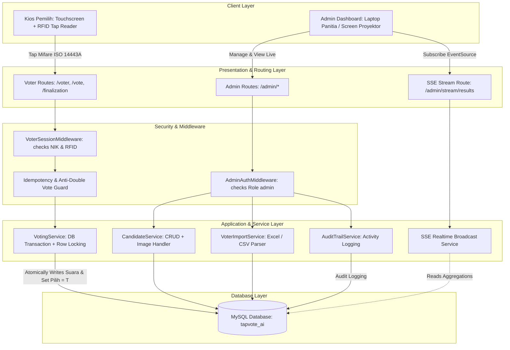

# System Architecture & Technical Specifications
## TapVote AI - Modern Realtime E-Voting SaaS

---

### 1. High-Level System Architecture

TapVote AI dirancang dengan arsitektur **Clean MVC + Service/Event Driven** di atas Laravel 12. Sistem memadukan antarmuka klien yang reaktif dengan backend berkinerja tinggi, menjamin integritas transaksi suara yang kritis.



---

### 2. RFID Mifare ISO 14443A Integration Architecture
1. **Hardware Reader**: USB RFID Reader (frekuensi 13.56 MHz, standar ISO/IEC 14443 Type A).
2. **Input Mechanism**:
   - Secara default, perangkat reader beroperasi dalam mode **HID Keyboard Emulation** (mengirim 8 hingga 10 digit Hex UID kartu diikuti sinyal `Enter`).
   - Web application menyematkan JavaScript *auto-focus listener* pada input form rahasia/terfokus di `/voter`.
   - Untuk skenario pengujian tanpa alat fisik (Demo Day / Gladi Bersih), sistem menyediakan **Demo Virtual Card Simulator** dengan tombol sekali klik untuk mentransmisikan UID kartu sample.
3. **Session Lifecycle**:
   - Tap valid $\rightarrow$ Session `voter_nik` dibuat dengan waktu hidup pendek (10 menit).
   - Pemilih menyelesaikan pemungutan suara $\rightarrow$ Session otomatis di-destroy di `/finalization` dalam hitungan 5 detik.

---

### 3. Realtime SSE (Server-Sent Events) Architecture
Berbeda dengan WebSocket yang membutuhkan server daemon terpisah (seperti Node/Reverb/Pusher), **SSE** adalah standar HTTP murni yang sangat andal, hemat bandwidth, dan kompatibel langsung dengan stack PHP/Laravel.

- **Header Respons**:
  ```http
  Content-Type: text/event-stream
  Cache-Control: no-cache
  Connection: keep-alive
  X-Accel-Buffering: no
  ```
- **Stream Payload (JSON)**:
  ```json
  {
    "timestamp": 1727202350,
    "metrics": {
      "total_voters": 250,
      "total_voted": 185,
      "turnout_percentage": 74.0,
      "remaining_voters": 65
    },
    "ketua_results": [
      {"nik": "KT01", "nama": "Dr. Ir. Hendra Gunawan", "nomor_urut": 1, "suara": 110, "persen": 59.46},
      {"nik": "KT02", "nama": "Siti Rahmawati, M.M.", "nomor_urut": 2, "suara": 75, "persen": 40.54}
    ],
    "pengawas_results": [
      {"nik": "PW01", "nama": "Budi Santoso, Ak.", "nomor_urut": 1, "suara": 98, "persen": 52.97},
      {"nik": "PW02", "nama": "Maya Kusuma, S.E.", "nomor_urut": 2, "suara": 87, "persen": 47.03}
    ],
    "recent_votes": [
      {"nama": "Ahmad Dani", "dept": "Operasional", "waktu": "21:15:30"}
    ]
  }
  ```
- **Client Auto-Reconnect**: Browser `EventSource` secara otomatis me-reconnect jika jaringan sempat terputus.

---

### 4. Concurrency & Atomicity Guarantee
Pemilihan suara melibatkan operasi kritis:
1. Pengecekan status `pilih = 'F'` dengan `SELECT ... FOR UPDATE` (Pessimistic Locking).
2. Insert ke `hasil_ketua` (`pemilih_nik`, `ketua_nik`).
3. Insert ke `hasil_pengawas` (`pengawas_nik`, `pemilih_nik`).
4. Update `pemilih` set `pilih = 'T'`, `voted_at = NOW()`.
5. Insert audit log ke `activity_logs`.
6. Seluruh langkah dieksekusi di dalam `DB::transaction()`. Jika ada kegagalan, rollback otomatis terjadi tanpa mengubah status pemilih.
