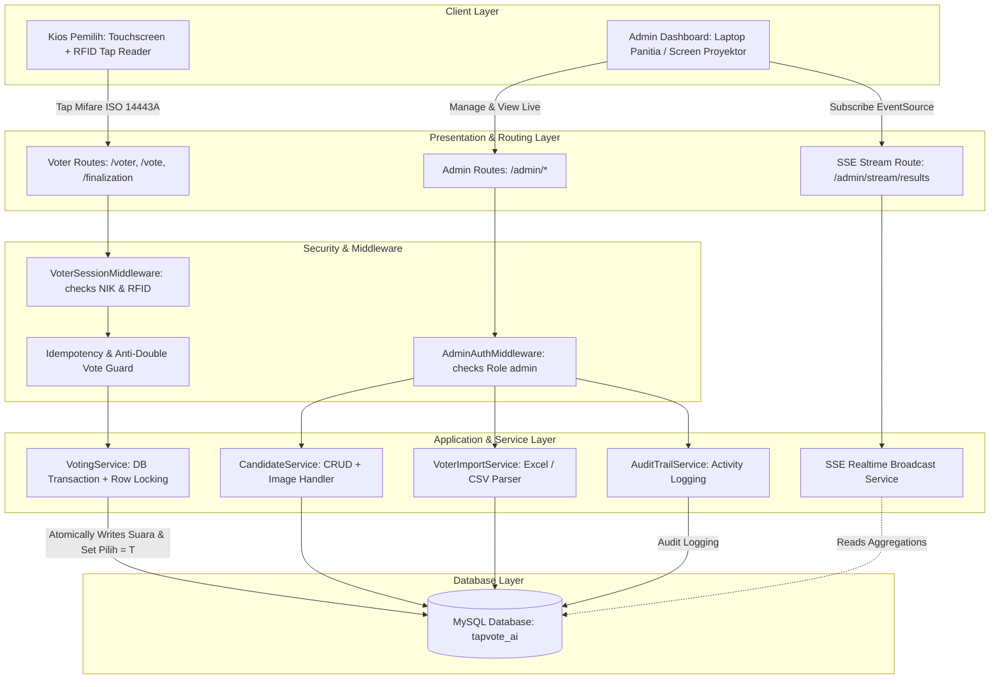

# System Architecture & Technical Specifications
## TapVote AI - Modern Realtime E-Voting SaaS

---

### 1. High-Level System Architecture

TapVote AI dirancang dengan arsitektur **Clean MVC + Service/Event Driven** di atas Laravel 12. Sistem memadukan antarmuka klien yang reaktif dengan backend berkinerja tinggi, menjamin integritas transaksi suara yang kritis.


```mermaid
flowchart TD
    subgraph Client Layer
        A[Kios Pemilih: Touchscreen + RFID Tap Reader]
        B[Admin Dashboard: Laptop Panitia / Screen Proyektor]
    end

    subgraph Presentation & Routing Layer
        C[Voter Routes: /voter, /vote, /finalization]
        D[Admin Routes: /admin/*]
        E[SSE Stream Route: /admin/stream/results]
    end

    subgraph Security & Middleware
        F[VoterSessionMiddleware: checks NIK & RFID]
        G[AdminAuthMiddleware: checks Role admin]
        H[Idempotency & Anti-Double Vote Guard]
    end

    subgraph Application & Service Layer
        I[VotingService: DB Transaction + Row Locking]
        J[CandidateService: CRUD + Image Handler]
        K[VoterImportService: Excel / CSV Parser]
        L[AuditTrailService: Activity Logging]
        M[SSE Realtime Broadcast Service]
    end

    subgraph Database Layer
        N[(MySQL Database: tapvote_ai)]
    end

    A -->|Tap Mifare ISO 14443A| C
    B -->|Manage & View Live| D
    B -->|Subscribe EventSource| E

    C --> F --> H --> I
    D --> G --> J & K & L
    E --> M

    I -->|Atomically Writes Suara & Set Pilih = T| N
    J --> N
    K --> N
    L -->|Audit Logging| N
    M -.->|Reads Aggregations| N
```

---

### 2. RFID Mifare ISO 14443A Integration Architecture
1. **Hardware Reader**: USB RFID Reader (frekuensi 13.56 MHz, standar ISO/IEC 14443 Type A).
2. **Input Mechanism**:
   - Secara default, perangkat reader beroperasi dalam mode **HID Keyboard Emulation** (mengirim 8 hingga 10 digit Hex UID kartu diikuti sinyal `Enter`).
   - Web application menyematkan JavaScript *auto-focus listener* pada input form rahasia/terfokus di `/voter`.
   - Untuk skenario pengujian tanpa alat fisik (Demo Day / Gladi Bersih), sistem menyediakan **Demo Virtual Card Simulator** dengan tombol sekali klik untuk mentransmisikan UID kartu sample.
3. **Session Lifecycle**:
   - Tap valid $\rightarrow$ Session `voter_nik` dibuat dengan waktu hidup pendek (10 menit).
   - Pemilih menyelesaikan pemungutan suara $\rightarrow$ Session otomatis di-destroy di `/finalization` dalam hitungan 5 detik.

---

### 3. Realtime SSE (Server-Sent Events) Architecture
Berbeda dengan WebSocket yang membutuhkan server daemon terpisah (seperti Node/Reverb/Pusher), **SSE** adalah standar HTTP murni yang sangat andal, hemat bandwidth, dan kompatibel langsung dengan stack PHP/Laravel.

- **Header Respons**:
  ```http
  Content-Type: text/event-stream
  Cache-Control: no-cache
  Connection: keep-alive
  X-Accel-Buffering: no
  ```
- **Stream Payload (JSON)**:
  ```json
  {
    "timestamp": 1727202350,
    "metrics": {
      "total_voters": 250,
      "total_voted": 185,
      "turnout_percentage": 74.0,
      "remaining_voters": 65
    },
    "ketua_results": [
      {"nik": "KT01", "nama": "Dr. Ir. Hendra Gunawan", "nomor_urut": 1, "suara": 110, "persen": 59.46},
      {"nik": "KT02", "nama": "Siti Rahmawati, M.M.", "nomor_urut": 2, "suara": 75, "persen": 40.54}
    ],
    "pengawas_results": [
      {"nik": "PW01", "nama": "Budi Santoso, Ak.", "nomor_urut": 1, "suara": 98, "persen": 52.97},
      {"nik": "PW02", "nama": "Maya Kusuma, S.E.", "nomor_urut": 2, "suara": 87, "persen": 47.03}
    ],
    "recent_votes": [
      {"nama": "Ahmad Dani", "dept": "Operasional", "waktu": "21:15:30"}
    ]
  }
  ```
- **Client Auto-Reconnect**: Browser `EventSource` secara otomatis me-reconnect jika jaringan sempat terputus.

---

### 4. Concurrency & Atomicity Guarantee
Pemilihan suara melibatkan operasi kritis:
1. Pengecekan status `pilih = 'F'` dengan `SELECT ... FOR UPDATE` (Pessimistic Locking).
2. Insert ke `hasil_ketua` (`pemilih_nik`, `ketua_nik`).
3. Insert ke `hasil_pengawas` (`pengawas_nik`, `pemilih_nik`).
4. Update `pemilih` set `pilih = 'T'`, `voted_at = NOW()`.
5. Insert audit log ke `activity_logs`.
6. Seluruh langkah dieksekusi di dalam `DB::transaction()`. Jika ada kegagalan, rollback otomatis terjadi tanpa mengubah status pemilih.

---

### 5. AI Reasoning Architecture (Google Gemini + Local Heuristic)
Arsitektur analisis AI dirancang dengan paradigma **Hybrid Multi-Tier Intelligence**:
1. **Tier 1 - Remote Cloud LLM (Google Gemini 2.0 Flash / 1.5 Flash)**:
   - Mentransmisikan payload terstruktur (metrik kuorum, histogram kecepatan 24 jam, disparitas unit kerja) melalui Google AI Studio REST API.
   - Menghasilkan narasi penalaran eksekutif, evaluasi margin elektoral, dan rekomendasi mitigasi risiko panitia.
2. **Tier 2 - Local Deterministic Heuristic Fallback Engine**:
   - Jika koneksi internet terputus, API key belum disetel, atau terjadi rate limit, sistem secara otomatis beralih ke analisis deterministik internal berbasis rumus matematika dan ambang batas kuorum AD/ART koperasi.
   - Hasil dijamin selalu tersedia 100% tanpa delay dan mendukung kedua bahasa (EN/ID).
3. **Cybersecurity & Forensic Reasoning (`/admin/logs/ai`)**:
   - Menganalisis log audit jejak kriptografis SHA-256 untuk mendeteksi serangan *brute force* UID RFID, anomali penolakan kartu asing, dan upaya bypass sistem.

---

### 6. Model Context Protocol (MCP) Server Architecture
TapVote AI mengintegrasikan server MCP standar (`mcp/server.js`) yang memungkinkan agen AI (Claude Desktop, Cursor, Antigravity, dsb.) berinteraksi dengan database pemilu:
- **Transpor Ganda**:
  - **Stdio Transport**: Untuk integrasi lokal instan melalui command line.
  - **HTTP / SSE Transport (`--http 3100`)**: Untuk koneksi remote agentik lintas jaringan LAN/WAN.
- **Daftar MCP Tools**:
  - `get_election_stats`: Mengambil statistik kuorum, total suara masuk, dan persentase partisipasi.
  - `list_candidates`: Mengambil data profil, nomor urut, visi, misi kandidat ketua dan pengawas.
  - `verify_voter_card`: Memvalidasi status keaktifan dan hak suara kartu RFID.
  - `get_ai_insights`: Mengambil penalaran analitik telemetri terbaru dari sistem.

---

### 7. Three.js 3D WebGL Pipeline & Procedural Assets
Sistem menggunakan Three.js untuk visualisasi interaktif real-time:
1. **3D Smartcard Keplek Lanyard Simulator (`/admin/dashboard`)**:
   - Mesh prosedural kartu identitas standar CR80 dengan material PBR (*Physically Based Rendering*).
   - Tekstur dinamis render kanvas: nameplate, portrait siluet, barcode vertikal, slot punch cutout, dan pita satin lanyard 3D ganda.
   - Interaktivitas orbit 360° via mouse dan touch drag.
2. **3D Doorprize Lottery Machine (`/admin/reports/doorprize` & `/doorprize`)**:
   - Model kotak hadiah emas 3D dengan pita merah dan sistem partikel partikel berkilau (*floating golden dust*).
   - Tiga status animasi: *Idle Float* $\rightarrow$ *High-Speed Spin Burst* $\rightarrow$ *Lid Opening Reveal*.

---

### 8. Internationalization (Intl) & Theme Engine
1. **Dual Language JSON Dictionaries**:
   - Menggunakan `lang/en.json` dan `lang/id.json` berisi lebih dari 740 pasangan kunci terjemahan terpadu.
   - Helper global `__('Key')` memfasilitasi lokalisasi dinamis tanpa mengganggu performa server.
2. **Admin Theme Engine (Light / Dark / System)**:
   - Terisolasi pada panel admin via kelas CSS `admin-dark` dan `dark` di elemen root `<html>`.
   - Menggunakan skema warna Slate-900 / Slate-800 dengan kontras tinggi berstandar WCAG AAA.

---

### 9. Progressive Web App (PWA) & Service Worker
- **Web App Manifest (`/manifest.json`)**: Mendukung instalasi standalone pada Chrome Android, Safari iOS, Edge Windows, dan Linux.
- **Service Worker (`/sw.js`)**: Strategi caching *Cache-First* untuk aset statis (fonts, SVG, Three.js models) dan *Network-First* untuk transaksi suara dinamis.

---

### 10. HTTP QUERY Method & Vector PDF Pipeline
1. **RFC Draft Safe HTTP `QUERY` Protocol**:
   - Digunakan pada endpoint `/admin/voters/query` untuk melewatkan payload filter JSON kompleks tanpa batasan panjang URL string query `GET`.
   - Fallback otomatis ke `POST` dengan header `X-HTTP-Method-Override: QUERY` jika browser klien memblokir kata kunci method non-standar.
2. **Vector PDF Generation Engine**:
   - Didukung oleh `Barryvdh\DomPDF` yang merender layout HTML/CSS cetak menjadi berkas PDF vektor murni beresolusi tinggi (A4 Landscape & Portrait) untuk berita acara pleno, sertifikat hasil rekapitulasi, dan log forensik audit.

