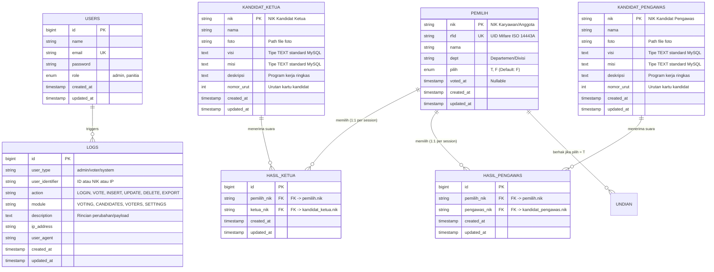

# Technical Architecture & Database Documentation
## TapVote AI - Database Schema & DDL/DML Specifications

---

### 1. Database Architecture & ERD Mapping
Sistem ini menggunakan basis data **MySQL** dengan nama basis data `tapvote_ai`.
Struktur tabel memetakan secara presisi kebutuhan rancangan dari papan tulis (`db_requirements.jpg`) dan brosur lomba (`lomba.jpg`), diperkaya dengan spesifikasi audit trail, enterprise logging, dan RBAC.



---

### 2. DDL (Data Definition Language) SQL

```sql
CREATE DATABASE IF NOT EXISTS `tapvote_ai` CHARACTER SET utf8mb4 COLLATE utf8mb4_unicode_ci;
USE `tapvote_ai`;

-- 1. Tabel Users (RBAC: Admin & Panitia)
CREATE TABLE IF NOT EXISTS `users` (
    `id` BIGINT UNSIGNED AUTO_INCREMENT PRIMARY KEY,
    `name` VARCHAR(255) NOT NULL,
    `email` VARCHAR(255) NOT NULL UNIQUE,
    `email_verified_at` TIMESTAMP NULL,
    `password` VARCHAR(255) NOT NULL,
    `role` ENUM('admin', 'panitia') NOT NULL DEFAULT 'admin',
    `remember_token` VARCHAR(100) NULL,
    `created_at` TIMESTAMP NULL DEFAULT CURRENT_TIMESTAMP,
    `updated_at` TIMESTAMP NULL DEFAULT CURRENT_TIMESTAMP ON UPDATE CURRENT_TIMESTAMP
) ENGINE=InnoDB DEFAULT CHARSET=utf8mb4 COLLATE=utf8mb4_unicode_ci;

-- 2. Tabel Pemilih (Berdasarkan Whiteboard db_requirements.jpg)
CREATE TABLE IF NOT EXISTS `pemilih` (
    `nik` VARCHAR(50) NOT NULL PRIMARY KEY,
    `rfid` VARCHAR(100) NOT NULL UNIQUE,
    `nama` VARCHAR(255) NOT NULL,
    `dept` VARCHAR(100) NOT NULL,
    `pilih` ENUM('T', 'F') NOT NULL DEFAULT 'F',
    `voted_at` TIMESTAMP NULL,
    `created_at` TIMESTAMP NULL DEFAULT CURRENT_TIMESTAMP,
    `updated_at` TIMESTAMP NULL DEFAULT CURRENT_TIMESTAMP ON UPDATE CURRENT_TIMESTAMP,
    INDEX `idx_pemilih_rfid` (`rfid`),
    INDEX `idx_pemilih_pilih` (`pilih`)
) ENGINE=InnoDB DEFAULT CHARSET=utf8mb4 COLLATE=utf8mb4_unicode_ci;

-- 3. Tabel Kandidat Ketua
CREATE TABLE IF NOT EXISTS `kandidat_ketua` (
    `nik` VARCHAR(50) NOT NULL PRIMARY KEY,
    `nama` VARCHAR(255) NOT NULL,
    `foto` VARCHAR(255) NULL,
    `visi` TEXT NOT NULL,
    `misi` TEXT NOT NULL,
    `deskripsi` TEXT NULL,
    `nomor_urut` INT NOT NULL DEFAULT 1,
    `created_at` TIMESTAMP NULL DEFAULT CURRENT_TIMESTAMP,
    `updated_at` TIMESTAMP NULL DEFAULT CURRENT_TIMESTAMP ON UPDATE CURRENT_TIMESTAMP,
    INDEX `idx_ketua_nomor` (`nomor_urut`)
) ENGINE=InnoDB DEFAULT CHARSET=utf8mb4 COLLATE=utf8mb4_unicode_ci;

-- 4. Tabel Kandidat Pengawas
CREATE TABLE IF NOT EXISTS `kandidat_pengawas` (
    `nik` VARCHAR(50) NOT NULL PRIMARY KEY,
    `nama` VARCHAR(255) NOT NULL,
    `foto` VARCHAR(255) NULL,
    `visi` TEXT NOT NULL,
    `misi` TEXT NOT NULL,
    `deskripsi` TEXT NULL,
    `nomor_urut` INT NOT NULL DEFAULT 1,
    `created_at` TIMESTAMP NULL DEFAULT CURRENT_TIMESTAMP,
    `updated_at` TIMESTAMP NULL DEFAULT CURRENT_TIMESTAMP ON UPDATE CURRENT_TIMESTAMP,
    INDEX `idx_pengawas_nomor` (`nomor_urut`)
) ENGINE=InnoDB DEFAULT CHARSET=utf8mb4 COLLATE=utf8mb4_unicode_ci;

-- 5. Tabel Hasil Pilihan Ketua (Hasil: Pemilih-Nik & Ketua-Nik)
CREATE TABLE IF NOT EXISTS `hasil_ketua` (
    `id` BIGINT UNSIGNED AUTO_INCREMENT PRIMARY KEY,
    `pemilih_nik` VARCHAR(50) NOT NULL UNIQUE,
    `ketua_nik` VARCHAR(50) NOT NULL,
    `created_at` TIMESTAMP NULL DEFAULT CURRENT_TIMESTAMP,
    `updated_at` TIMESTAMP NULL DEFAULT CURRENT_TIMESTAMP ON UPDATE CURRENT_TIMESTAMP,
    CONSTRAINT `fk_hasil_ketua_pemilih` FOREIGN KEY (`pemilih_nik`) REFERENCES `pemilih` (`nik`) ON DELETE CASCADE ON UPDATE CASCADE,
    CONSTRAINT `fk_hasil_ketua_kandidat` FOREIGN KEY (`ketua_nik`) REFERENCES `kandidat_ketua` (`nik`) ON DELETE RESTRICT ON UPDATE CASCADE,
    INDEX `idx_hasil_ketua_kandidat` (`ketua_nik`)
) ENGINE=InnoDB DEFAULT CHARSET=utf8mb4 COLLATE=utf8mb4_unicode_ci;

-- 6. Tabel Hasil Pilihan Pengawas (Hasil: Pengawas-Nik & Pemilih-Nik)
CREATE TABLE IF NOT EXISTS `hasil_pengawas` (
    `id` BIGINT UNSIGNED AUTO_INCREMENT PRIMARY KEY,
    `pemilih_nik` VARCHAR(50) NOT NULL UNIQUE,
    `pengawas_nik` VARCHAR(50) NOT NULL,
    `created_at` TIMESTAMP NULL DEFAULT CURRENT_TIMESTAMP,
    `updated_at` TIMESTAMP NULL DEFAULT CURRENT_TIMESTAMP ON UPDATE CURRENT_TIMESTAMP,
    CONSTRAINT `fk_hasil_pengawas_pemilih` FOREIGN KEY (`pemilih_nik`) REFERENCES `pemilih` (`nik`) ON DELETE CASCADE ON UPDATE CASCADE,
    CONSTRAINT `fk_hasil_pengawas_kandidat` FOREIGN KEY (`pengawas_nik`) REFERENCES `kandidat_pengawas` (`nik`) ON DELETE RESTRICT ON UPDATE CASCADE,
    INDEX `idx_hasil_pengawas_kandidat` (`pengawas_nik`)
) ENGINE=InnoDB DEFAULT CHARSET=utf8mb4 COLLATE=utf8mb4_unicode_ci;

-- 7. Tabel Activity Logs (Audit CRUD & Transaksi)
CREATE TABLE IF NOT EXISTS `activity_logs` (
    `id` BIGINT UNSIGNED AUTO_INCREMENT PRIMARY KEY,
    `user_type` VARCHAR(50) NOT NULL DEFAULT 'system',
    `user_identifier` VARCHAR(100) NULL,
    `action` VARCHAR(100) NOT NULL,
    `module` VARCHAR(100) NOT NULL,
    `description` TEXT NOT NULL,
    `ip_address` VARCHAR(45) NULL,
    `user_agent` TEXT NULL,
    `created_at` TIMESTAMP NULL DEFAULT CURRENT_TIMESTAMP,
    `updated_at` TIMESTAMP NULL DEFAULT CURRENT_TIMESTAMP ON UPDATE CURRENT_TIMESTAMP,
    INDEX `idx_logs_module` (`module`),
    INDEX `idx_logs_action` (`action`)
) ENGINE=InnoDB DEFAULT CHARSET=utf8mb4 COLLATE=utf8mb4_unicode_ci;
```

---

### 3. Logika Query Laporan Utama

#### 3.1. Siapa Pemenang Ketua Koperasi & Rincian Suara
```sql
SELECT 
    k.nik,
    k.nama,
    k.nomor_urut,
    COUNT(h.id) AS total_suara,
    ROUND((COUNT(h.id) / (SELECT GREATEST(COUNT(*), 1) FROM hasil_ketua)) * 100, 2) AS persentase
FROM kandidat_ketua k
LEFT JOIN hasil_ketua h ON k.nik = h.ketua_nik
GROUP BY k.nik, k.nama, k.nomor_urut
ORDER BY total_suara DESC, k.nomor_urut ASC;
```

#### 3.2. Siapa Pemenang Pengawas Koperasi & Rincian Suara
```sql
SELECT 
    p.nik,
    p.nama,
    p.nomor_urut,
    COUNT(h.id) AS total_suara,
    ROUND((COUNT(h.id) / (SELECT GREATEST(COUNT(*), 1) FROM hasil_pengawas)) * 100, 2) AS persentase
FROM kandidat_pengawas p
LEFT JOIN hasil_pengawas h ON p.nik = h.pengawas_nik
GROUP BY p.nik, p.nama, p.nomor_urut
ORDER BY total_suara DESC, p.nomor_urut ASC;
```

#### 3.3. Trace Back Anggota Memilih Siapa (Audit Trail)
```sql
SELECT 
    pem.nik AS pemilih_nik,
    pem.nama AS pemilih_nama,
    pem.dept AS pemilih_dept,
    pem.voted_at AS waktu_memilih,
    ket.nama AS pilihan_ketua,
    peng.nama AS pilihan_pengawas
FROM pemilih pem
LEFT JOIN hasil_ketua hk ON pem.nik = hk.pemilih_nik
LEFT JOIN kandidat_ketua ket ON hk.ketua_nik = ket.nik
LEFT JOIN hasil_pengawas hp ON pem.nik = hp.pemilih_nik
LEFT JOIN kandidat_pengawas peng ON hp.pengawas_nik = peng.nik
WHERE pem.pilih = 'T'
ORDER BY pem.voted_at DESC;
```

#### 3.4. Siapa Saja yang Berhak Mengikuti Undian Doorprize
```sql
SELECT 
    nik,
    nama,
    dept,
    voted_at
FROM pemilih
WHERE pilih = 'T'
ORDER BY nama ASC;
```

#### 3.5. Skema & Pencatatan Pemenang Undian Hadiah (Doorprize Claim Tracking)
```sql
-- Tabel Master Hadiah Doorprize
CREATE TABLE IF NOT EXISTS `doorprizes` (
    `id` BIGINT UNSIGNED AUTO_INCREMENT PRIMARY KEY,
    `title` VARCHAR(255) NOT NULL,
    `category` VARCHAR(100) NOT NULL DEFAULT 'Elektronik',
    `quantity` INT UNSIGNED NOT NULL DEFAULT 1,
    `sponsor` VARCHAR(255) NULL,
    `icon` VARCHAR(50) NULL,
    `image` VARCHAR(255) NULL,
    `description` TEXT NULL,
    `created_at` TIMESTAMP NULL DEFAULT CURRENT_TIMESTAMP,
    `updated_at` TIMESTAMP NULL DEFAULT CURRENT_TIMESTAMP ON UPDATE CURRENT_TIMESTAMP
) ENGINE=InnoDB DEFAULT CHARSET=utf8mb4 COLLATE=utf8mb4_unicode_ci;

-- Tabel Log Pemenang & Status Klaim
CREATE TABLE IF NOT EXISTS `doorprize_winners` (
    `id` BIGINT UNSIGNED AUTO_INCREMENT PRIMARY KEY,
    `doorprize_id` BIGINT UNSIGNED NOT NULL,
    `nik` VARCHAR(50) NOT NULL,
    `won_at` TIMESTAMP NOT NULL DEFAULT CURRENT_TIMESTAMP,
    `status` ENUM('pending', 'accepted', 'rejected', 'other') NOT NULL DEFAULT 'pending',
    `status_note` VARCHAR(255) NULL,
    `received_at` TIMESTAMP NULL,
    `created_at` TIMESTAMP NULL DEFAULT CURRENT_TIMESTAMP,
    `updated_at` TIMESTAMP NULL DEFAULT CURRENT_TIMESTAMP ON UPDATE CURRENT_TIMESTAMP,
    FOREIGN KEY (`doorprize_id`) REFERENCES `doorprizes`(`id`) ON DELETE CASCADE,
    FOREIGN KEY (`nik`) REFERENCES `pemilih`(`nik`) ON DELETE CASCADE
) ENGINE=InnoDB DEFAULT CHARSET=utf8mb4 COLLATE=utf8mb4_unicode_ci;
```
