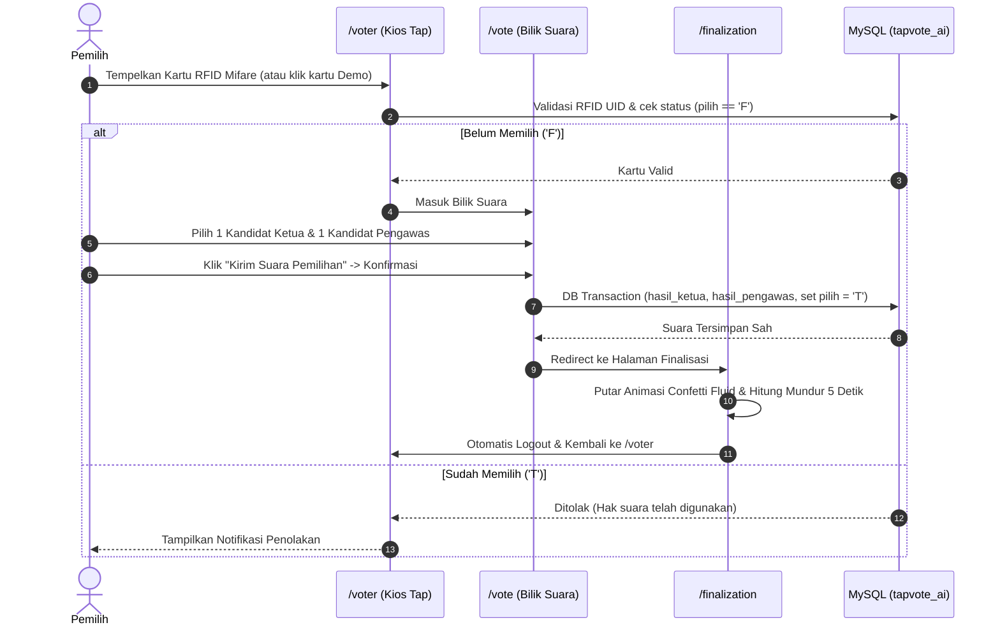

# Panduan Operasional & User Guide
## TapVote AI - E-Voting Koperasi Modern Berbasis RFID Mifare ISO 14443A

---

### 1. Kredensial & Akses Cepat

| Portal / Sesi | URL Akses | Kredensial / Cara Masuk |
| :--- | :--- | :--- |
| **Kios Pemilih (Bilik Suara)** | `http://localhost:8000/voter` | Tap ID Card RFID Mifare atau klik kartu pada section **Demo Mode** |
| **Panel Admin / Panitia** | `http://localhost:8000/admin/login` | **Email**: `admin@tapvote.ai` **Password**: `admin123` |
| **Beranda / Overview** | `http://localhost:8000` | Landing Page dengan navigasi cepat ke Kios & Panel Admin |

---

### 2. Panduan Penggunaan Peran Pemilih (Voter Role)

#### Langkah-langkah:
1. **Langkah 1 (Tap Card)**: Buka `http://localhost:8000/voter`. Dekatkan kartu Mifare ISO 14443A ke sensor reader USB. Sistem otomatis memvalidasi UID kartu secara nirsentuh.
   - *Tanpa Alat Fisik*: Gunakan section **Demo Mode** di bawah radar untuk mengklik salah satu anggota sample (misal Dimas, Sarah, Reza).
2. **Langkah 2 (Pilih 2 Kandidat)**: Pada halaman `/vote`, pilih 1 Ketua Koperasi dan 1 Pengawas Koperasi. Pemilih dapat mengklik tombol "Baca Visi & Misi" untuk membaca visi misi lengkap calon.
3. **Langkah 3 (Konfirmasi)**: Klik tombol "Kirim Suara Pemilihan", cek preview pilihan pada dialog konfirmasi, lalu klik "Ya, Kirim Suara!".
4. **Langkah 4 (Selesai)**: Halaman `/finalization` akan merayakan suara Anda dengan ledakan confetti fluid dan secara otomatis melakukan *countdown 5 detik* lalu kembali ke `/voter` untuk antrean pemilih berikutnya.

---

### 3. Panduan Penggunaan Peran Administrator (Admin Role)

#### 3.1. Live Dashboard Realtime SSE (`/admin/dashboard`)
- Menampilkan grafik interaktif **ApexCharts** (donut chart perolehan suara ketua & pengawas) dan grafik timeline area pergerakan suara per jam.
- Terhubung secara otomatis ke endpoint **Server-Sent Events (SSE)** `/admin/stream/results` dengan auto-reconnect dan fallback polling.
- **Ekspor Dokumen Rekapitulasi**: Tombol "Unduh Rekap PDF (A4)" yang menghasilkan sertifikat PDF resmi dan tombol "Unduh Rekap Excel (CSV UTF-8 BOM)".
- **Uji Koneksi Gemini AI**: Uji latensi (ms) API key Google Gemini secara live.
- **Kontrol Sistem Voting**: Tombol START, PAUSE, dan STOP voting di navbar dengan proteksi throttling anti-double click.

#### 3.2. Manajemen Kandidat Ketua & Pengawas (`/admin/ketua` & `/admin/pengawas`)
- Tambah, edit, dan hapus kandidat.
- Form mencakup: Nomor Urut, NIK, Nama Lengkap & Gelar, Upload Foto, serta **Visi** dan **Misi** (tipe MySQL `TEXT`).
- Upload foto kandidat otomatis tersimpan di storage publik yang dapat diakses langsung.

#### 3.3. Data Pemilih & Dynamic HTTP QUERY (`/admin/voters`)
- Toolbar pencarian dan filter responsif optimal untuk iPad Mini, ponsel, dan PC.
- Menggunakan metode HTTP `QUERY` (RFC draft) dengan live sorting dan pagination interaktif.
- **Import Bulk**: Klik tombol "Import CSV", pilih file dengan kolom `nik,nama,dept,rfid`.
- **Reset Suara**: Mengosongkan seluruh suara hasil pemilihan dan mengembalikan status ke 'F'.

#### 3.4. Laporan Eksekutif (`/admin/reports/*`)
1. **Pemenang Ketua Koperasi (`/admin/reports/ketua`)**:
   - Menampilkan pemenang suara terbanyak, persentase, dan rincian suara per departemen.
   - Tombol "Export Excel" dan "Cetak Dokumen Laporan".
2. **Pemenang Pengawas Koperasi (`/admin/reports/pengawas`)**:
   - Menampilkan pemenang suara terbanyak, persentase, dan rincian suara per departemen.
   - Tombol "Export Excel" dan "Cetak Dokumen Laporan".
3. **Trace Back Pilihan Anggota (`/admin/reports/traceback`)**:
   - Audit trail untuk saksi & panitia guna merekonsiliasi pilihan individu anggota (NIK, Nama, Dept, Pilihan Ketua, Pilihan Pengawas, Waktu Vote).
   - Tombol "Export Audit CSV" dan "Cetak Rekap".
4. **Undian Doorprize & Status Klaim Hadiah (`/admin/reports/doorprize`)**:
   - Tabel master hadiah dengan upload foto reward dan sisa kuota inventaris.
   - Mesin pengundian interaktif dengan silinder digital animated SVG tanpa hitung mundur angka.
   - Pencatatan log pemenang dengan status klaim: *Sudah Diterima (accepted)*, *Ditolak (rejected)*, *Belum Diambil (pending)*, atau *Alasan Lain (other)*.
   - Tombol shortcut panggung layar proyektor penonton (`/doorprize`).

#### 3.5. Audit Activity Logs (`/admin/logs`)
- Memonitor seluruh jejak audit transaksi (LOGIN, VOTE, INSERT, UPDATE, DELETE, RESET, IMPORT) beserta IP address, user identifier, dan waktu kejadian.
