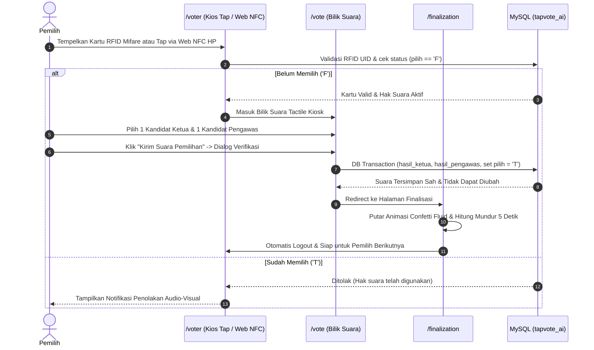

# Panduan Operasional & User Guide
## TapVote AI - E-Voting Koperasi Modern Berbasis RFID Mifare ISO 14443A & AI Intelligence

---

### 1. Kredensial & Akses Cepat

| Portal / Sesi | URL Akses | Kredensial / Cara Masuk |
| :--- | :--- | :--- |
| **Kios Pemilih (Bilik Suara)** | `http://localhost:8000/voter` | Tap ID Card RFID Mifare, Web NFC smartphone, atau Demo Mode |
| **Panel Admin / Panitia** | `http://localhost:8000/admin/login` | **Email**: `admin@tapvote.ai`<br>**Password**: `admin123` |
| **Beranda / Overview** | `http://localhost:8000` | Landing Page dengan telemetry live dan navigasi cepat |
| **Panggung Undian Doorprize** | `http://localhost:8000/doorprize` | Layar proyektor 3D Three.js & Silinder Digital |
| **Ganti Bahasa (Intl)** | Navbar Topbar | Switcher Bahasa Indonesia (`/lang/id`) & English (`/lang/en`) |
| **Tema Gelap / Terang** | Tombol Matahari/Bulan | Dark Mode instan (persisten di `localStorage`) di seluruh panel |

---

### 2. Panduan Penggunaan Peran Pemilih (Voter Role)


```mermaid
sequenceDiagram
    autonumber
    actor V as Pemilih
    participant K as /voter (Kios Tap / Web NFC)
    participant B as /vote (Bilik Suara)
    participant F as /finalization
    participant DB as MySQL (tapvote_ai)

    V->>K: Tempelkan Kartu RFID Mifare atau Tap via Web NFC HP
    K->>DB: Validasi RFID UID & cek status (pilih == 'F')
    alt Belum Memilih ('F')
        DB-->>K: Kartu Valid & Hak Suara Aktif
        K->>B: Masuk Bilik Suara Tactile Kiosk
        V->>B: Pilih 1 Kandidat Ketua & 1 Kandidat Pengawas
        V->>B: Klik "Kirim Suara Pemilihan" -> Dialog Verifikasi
        B->>DB: DB Transaction (hasil_ketua, hasil_pengawas, set pilih = 'T')
        DB-->>B: Suara Tersimpan Sah & Tidak Dapat Diubah
        B->>F: Redirect ke Halaman Finalisasi
        F->>F: Putar Animasi Confetti Fluid & Hitung Mundur 5 Detik
        F->>K: Otomatis Logout & Siap untuk Pemilih Berikutnya
    else Sudah Memilih ('T')
        DB-->>K: Ditolak (Hak suara telah digunakan)
        K-->>V: Tampilkan Notifikasi Penolakan Audio-Visual
    end
```

#### Langkah-langkah Pemilih:
1. **Langkah 1 (Tap Card / Web NFC Smartphone)**:
   - Buka `http://localhost:8000/voter` pada tablet kios atau smartphone panitia.
   - **Hardware USB Reader**: Dekatkan kartu Mifare ISO 14443A ke reader USB.
   - **Smartphone Sensor (Web NFC `NDEFReader`)**: Pada perangkat Android berbasis Chrome dengan chip NFC aktif, tempelkan kartu langsung ke bodi belakang ponsel. Sensor Web NFC secara instan membaca UID kartu nirsentuh tanpa memerlukan instalasi aplikasi tambahan.
   - **Mode Simulasi/Demo**: Jika belum memiliki reader fisik, klik salah satu sample kartu anggota pada section **Demo Simulator** di bawah radar.
2. **Langkah 2 (Bilik Suara Tactile Kiosk `/vote`)**:
   - Sistem membuka bilik suara interaktif.
   - Pemilih memilih **1 Kandidat Ketua** dan **1 Kandidat Pengawas**.
   - Setiap kartu kandidat memiliki tombol **"Baca Visi & Misi"** untuk meninjau program kerja calon secara transparan.
   - Desain responsif mobile: Mendukung tombol "Expand All / Collapse All" dan perataan kartu grid otomatis untuk kenyamanan membaca di layar sentuh kecil.
3. **Langkah 3 (Verifikasi & Konfirmasi Suara)**:
   - Klik tombol **"Kirim Suara Pemilihan"**.
   - Modal konfirmasi menampilkan ringkasan kandidat yang Anda pilih.
   - Klik **"Ya, Kirim Suara!"** untuk mengunci pilihan secara atomik ke basis data.
4. **Langkah 4 (Finalisasi & Auto-Logout)**:
   - Halaman `/finalization` merayakan suara Anda dengan animasi confetti fluid.
   - Sistem melakukan hitung mundur (countdown) 5 detik dan otomatis kembali ke `/voter` guna menjaga kerahasiaan bilik bagi pemilih berikutnya.

---

### 3. Panduan Penggunaan Peran Administrator (Admin Role)

#### 3.1. Executive Dashboard & Live Realtime SSE (`/admin/dashboard`)
- **Telemetry Realtime**: Donut chart ApexCharts perolehan suara ketua & pengawas terhubung ke stream SSE `/admin/stream/results` dengan auto-reconnect dan dynamic frequency throttle.
- **Voting Surge & Time Distribution**: Grafik linimasa perolehan suara per jam. Pilihan rentang waktu (1 jam, 6 jam, 12 jam, 24 jam) bereaksi secara instan tanpa tombol reload.
- **AI Conclusion Engine**: Narasi analitis instan (status kuorum $\ge 50\%$, margin keunggulan, confidence level, dan rekomendasi panitia) menggunakan Google Gemini 2.0 Flash dengan failover otomatis ke Local Heuristic Engine jika koneksi internet terputus.
- **Emergency Controller**: Tombol kendali voting (START, PAUSE, STOP) di navbar dengan proteksi throttling anti-double submission.

#### 3.2. Mata Langit - Deep Telemetry Analytics (`/admin/analytics`)
- **Decoupled Candidate Tabs**: Tab analitis khusus yang memisahkan perolehan suara **Ketua Koperasi** dan **Pengawas Koperasi** di bawah header, lengkap dengan indikator kandidat unggul, margin gap, dan persentase keterpilihan.
- **Partisipasi Departemen**: Visualisasi tingkat keaktifan voting per divisi kerja untuk mengidentifikasi departemen yang belum mencapai target kuorum.
- **Ekspor Dokumen Resmi**: Tombol unduh laporan analisis telemetri format Vector PDF A4 berstempel resmi.

#### 3.3. Vote Flow - Electoral Dynamics (`/admin/vote-flow`)
- **Visualisasi Sankey Diagram**: Memetakan persebaran suara dari departemen ke kandidat ketua dan pengawas untuk menganalisis basis dukungan elektoral.
- **AI Summary**: Ringkasan kecenderungan memilih per divisi yang dihasilkan secara otomatis oleh Gemini AI.

#### 3.4. DPT Pemilih & Safe HTTP QUERY (`/admin/voters`)
- **Pencarian Aman RFC HTTP QUERY**: Input filter pencarian, divisi, dan status memilih diproses secara server-side tanpa batas panjang URL query parameter.
- **Doorprize Inclusion Toggle**: Tombol toggle switch 2-elemen (`can_raffle`) untuk memasukkan atau mengecualikan anggota tertentu dari pool undian doorprize secara presisi.
- **Manajemen Massal**: Impor DPT via CSV/Excel, unduh template impor, ekspor DPT ke Excel Spreadsheet (UTF-8 BOM), dan cetak Berita Acara DPT Vector PDF.
- **Gladi Resik (Reset Suara)**: Tombol "Reset Suara" untuk mengembalikan status pemilih ke 'F' dan menghapus tabel hasil suara sebelum hari pelaksanaan resmi.

#### 3.5. Manajemen Kandidat & Drag-and-Drop Reorder (`/admin/ketua` & `/admin/pengawas`)
- Tambah, sunting, dan hapus kandidat lengkap dengan NIK, Gelar, Foto, serta teks Visi & Misi.
- **Drag-and-Drop Prioritas Nomor Urut**: Ubah urutan nomor urut kandidat cukup dengan menarik (drag) baris kandidat ke atas/bawah. Urutan baru otomatis tersimpan ke basis data via endpoint `/reorder`.

#### 3.6. Manajemen Hadiah & Undian Doorprize (`/admin/reports/doorprize`)
- **Master Hadiah**: Kelola inventaris doorprize, kuota ketersediaan, sponsor, dan upload foto hadiah.
- **Mesin Undian Server-Side CSPRNG**: Pengundian menggunakan algoritma pseudo-random number generator terproteksi di sisi server (`random_int`) untuk menjamin transparansi tanpa manipulasi sisi klien.
- **Pelacakan Status Klaim**: Catat status penyerahan hadiah secara detail (*Pending*, *Diterima / Accepted*, *Ditolak / Rejected*, atau *Alasan Lain / Other*) beserta waktu serah terima fisik.
- **Panggung Visual 3D Layar Lebar (`/doorprize`)**: Tampilan proyektor untuk audiens rapat anggota dengan silinder berputar animated dan bola partikel WebGL Three.js.

#### 3.7. Pengaturan Sistem & Diagnostik Gemini AI (`/admin/settings`)
- **Target Kuorum & Durasi Sesi**: Konfigurasi persentase minimal kuorum rapat anggota dan durasi sesi bilik suara.
- **Gemini AI API Key Diagnostic**: Simpan API Key Google Gemini terenkripsi dan jalankan tes konektivitas satu-klik untuk melihat latensi respons (ms).

---

### 4. Integrasi Model Context Protocol (MCP) untuk AI Assistants

Bagi pengembang dan panitia yang menggunakan asisten AI (**Claude Desktop**, **Cursor**, **Google Antigravity**, **Zed**), sistem menyediakan MCP Server bawaan di direktori `mcp/`:

```bash
# Menjalankan MCP Server dalam mode Stdio
npm run mcp

# Menjalankan MCP Server dalam mode HTTP / SSE (Port 3100)
npm run mcp:http
```

Alat (Tools) MCP yang dapat dipanggil langsung oleh asisten AI:
- `get_election_metrics`: Memeriksa persentase turnout, kuorum $\ge 50\%$, dan pemimpin perolehan suara.
- `get_candidate_standings`: Rekapitulasi suara kandidat ketua & pengawas.
- `get_candidate_profile`: Mengambil visi, misi, dan biodata kandidat berdasarkan nomor urut atau NIK.
- `get_ai_election_conclusion`: Menghasilkan kesimpulan evaluasi pemilihan otomatis.
- `verify_voter_card`: Memverifikasi keabsahan UID kartu RFID atau NIK anggota dalam DPT.
